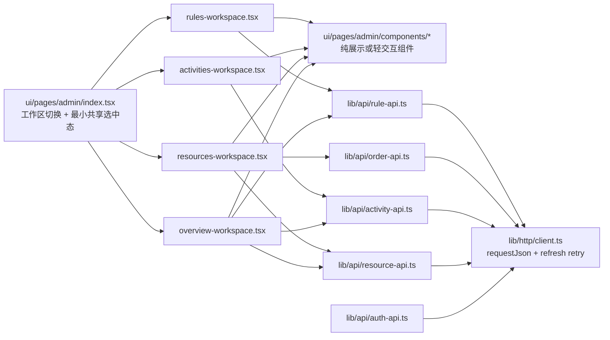
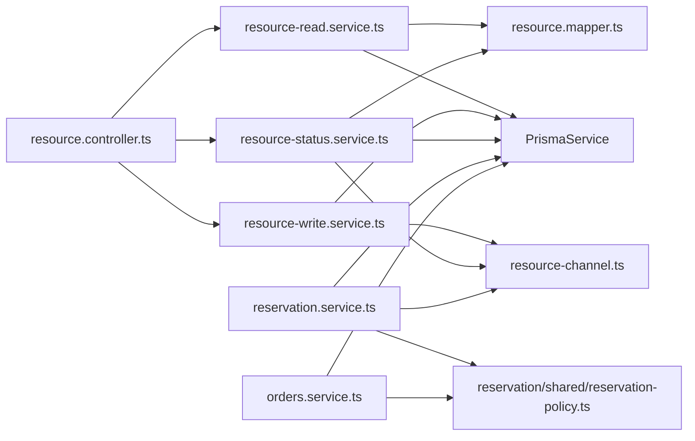

# 后台与资源预约边界拆分方案

## 背景

当前仓库的一层目录已经稳定为 `apps/web`、`apps/api`、`packages`、`docs` 四块，整体方向正确；但二层边界已经出现明显失衡，主要集中在以下位置：

- 前端后台入口 `apps/web/src/ui/pages/admin-page.tsx` 同时承载工作区切换、数据查询、写操作、表单状态和展示组件
- 前端 `apps/web/src/lib/api.ts` 同时承担 HTTP 传输层、认证刷新逻辑、业务 API 和 session store 副作用
- 后端 `apps/api/src/modules/resource/resource.service.ts` 同时承担资源读写、放号规则、关闭规则、预约状态聚合和模型映射
- 后端 `reservation` 与 `orders` 模块内重复实现签到窗口、预约类别判断和预约开始时间提取等共享规则

这些问题已经开始影响模块内聚、依赖方向和可读性，因此需要先把拆分蓝图正式入库，再按蓝图分阶段实施。

## 目标

本方案的目标不是引入新的大而全抽象，而是做最小必要拆分：

1. 保持当前 monorepo 一级结构不变
2. 保持后端继续以 `modules/*` 为主组织轴
3. 把已失控的大页面、大服务拆回清晰职责边界
4. 为后续代码改造提供稳定目录蓝图和依赖规则

## 设计原则

### 1. 单一组织

- 前端继续以 `lib / store / ui` 组织
- 后端继续以 `infrastructure / modules` 组织
- 不新增 `apps/api/src/domain/` 之类的第二组织轴

### 2. 最小必要拆分

- 只拆已经明显越界的页面、服务和共享规则
- 不引入 `repository`、`facade`、`base service`、`base controller`
- 不为了“未来可能会用”预埋猜测性抽象

### 3. 共享规则只抽纯逻辑

- 只抽已经在多处重复出现的纯规则
- 不把主流程、数据库访问和跨模块协调一并塞进共享 helper

## 范围

本轮蓝图覆盖以下四块：

1. 管理端后台页面边界
2. 前端 HTTP 传输层与业务 API 边界
3. 后端 `resource` 模块边界
4. 后端 `reservation` 与 `orders` 的共享预约规则边界

本轮不作为主拆分目标的内容：

- 学生端页面大规模重构
- `activities` 模块继续深拆
- `packages/shared-types` 的分目录改造
- 引入新的状态管理方案
- 引入新的后端抽象层

## 目标目录

### 前端

```text
apps/web/src/
  lib/
    http/
      client.ts
      errors.ts
    api/
      auth-api.ts
      resource-api.ts
      activity-api.ts
      order-api.ts
      rule-api.ts

  ui/
    pages/
      admin/
        index.tsx
        workspaces/
          overview-workspace.tsx
          resources-workspace.tsx
          activities-workspace.tsx
          rules-workspace.tsx
        components/
          mutation-state.tsx
          admin-stat-card.tsx
          admin-info-card.tsx
          reservation-status-list.tsx
          workspace-badge.tsx
          quick-workspace-card.tsx
          rule-summary-row.tsx
```

### 后端

```text
apps/api/src/modules/
  reservation/
    reservation.module.ts
    reservation.controller.ts
    reservation.service.ts
    shared/
      reservation-policy.ts

  orders/
    orders.module.ts
    orders.controller.ts
    orders.service.ts

  resource/
    resource.module.ts
    resource.controller.ts
    resource-channel.ts
    resource-read.service.ts
    resource-write.service.ts
    resource-status.service.ts
    resource.mapper.ts
    dto/
```

## 模块职责

### 前端后台页

- `ui/pages/admin/index.tsx`
  - 只保留工作区切换
  - 只保留必要的共享选中态
  - 不再承载全部 `query / mutation / form state`

- `ui/pages/admin/workspaces/*`
  - 各自管理本工作区的数据查询和写操作
  - 各自拥有本工作区表单状态
  - 只向局部展示组件下发必要 props

- `ui/pages/admin/components/*`
  - 只承载展示或轻交互逻辑
  - 不持有跨工作区业务状态

### 前端 API 层

- `lib/http/client.ts`
  - 统一 `requestJson`
  - 统一 `401 -> refresh -> retry`
  - 统一错误构造
  - 只处理传输层

- `lib/api/*-api.ts`
  - 按资源、活动、订单、规则、认证划分接口
  - 不混合多个业务域

### 后端资源域

- `resource-read.service.ts`
  - 公共资源列表
  - 公共资源详情
  - 管理端资源详情读取

- `resource-write.service.ts`
  - 资源创建/更新
  - 单元创建
  - 组合创建
  - 放号规则创建/更新
  - 关闭规则创建/更新

- `resource-status.service.ts`
  - 管理端预约状态聚合
  - 公共预约状态聚合

- `resource.mapper.ts`
  - `Prisma -> shared-types` 映射
  - 保持输出模型转换集中，不散落在多个 service 内

### 预约共享规则

- `reservation/shared/reservation-policy.ts`
  - 预约类别判断
  - 预约开始时间提取
  - 签到窗口计算

这个文件只允许放当前已重复的纯逻辑，不负责：

- 创建预约
- 更新订单状态
- 数据库查询
- 队列协调

## 依赖规则

### 前端依赖

- `workspaces/*` 可以依赖 `lib/api/*`、`components/*`、`query-client`
- `components/*` 不允许反向依赖 `workspaces/*`
- `lib/http/*` 不允许依赖具体业务 API 模块

### 后端依赖

- `resource.controller.ts` 仅依赖资源域内拆分后的 service
- `orders.service.ts` 与 `reservation.service.ts` 共享 `reservation/shared/reservation-policy.ts`
- `resource` 模块不新增 `facade` 包装层

## 实施顺序

建议实施顺序如下：

1. 先拆 `apps/web/src/lib/api.ts`
2. 再拆后台页面 `admin-page.tsx`
3. 再拆 `resource.service.ts`
4. 最后收拢 `reservation-policy.ts`

这样做的原因是：

- 先把传输层与业务 API 分开，后续前端页面拆分更顺手
- 后台页是最明显的大组件，最能直接降低阅读成本
- `resource.service.ts` 是后端主要耦合点，适合在前端边界稳定后再拆
- 共享预约规则要放在最后抽，避免一开始把范围拉太大

## 验证范围

拆分阶段至少要覆盖以下回归点：

### 前端

- 登录恢复流程
- 管理端资源工作区加载
- 管理端取消预约入口
- 订单详情页取消与签到流程

### 后端

- 资源列表与资源详情
- 管理端资源配置写操作
- 资源预约状态聚合查询
- 预约签到与爽约判定相关路径

## 架构图

### 前端边界图



### 后端边界图



## 非目标

以下内容明确不在本轮拆分目标内：

- 为所有模块统一建立 repository 层
- 为所有 service 增加继承体系
- 为未来未出现的问题预留可配置抽象
- 一次性重写整个前端目录结构
- 一次性重写整个后端模块结构

## 后续动作

1. 以本文件为正式蓝图开展代码拆分
2. 拆分前先按本蓝图补 feature list 跟踪项
3. 拆分过程中补对应 ADR 和进度记录
