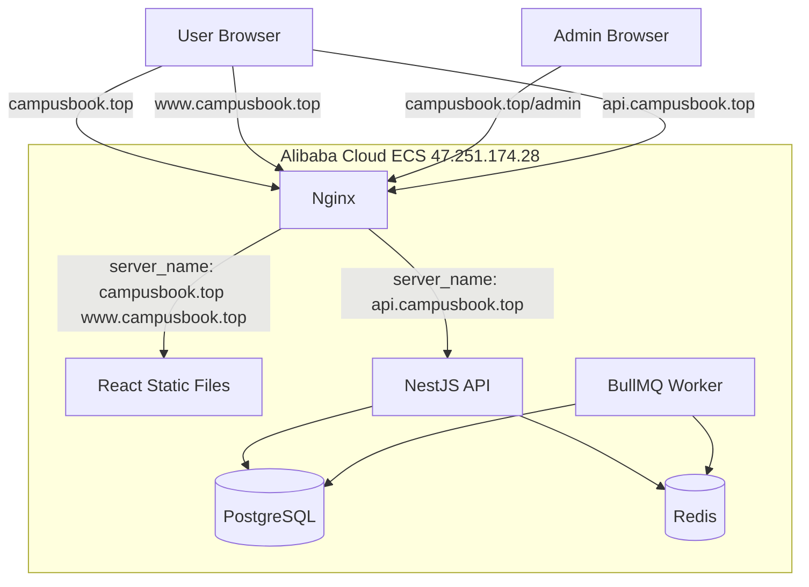
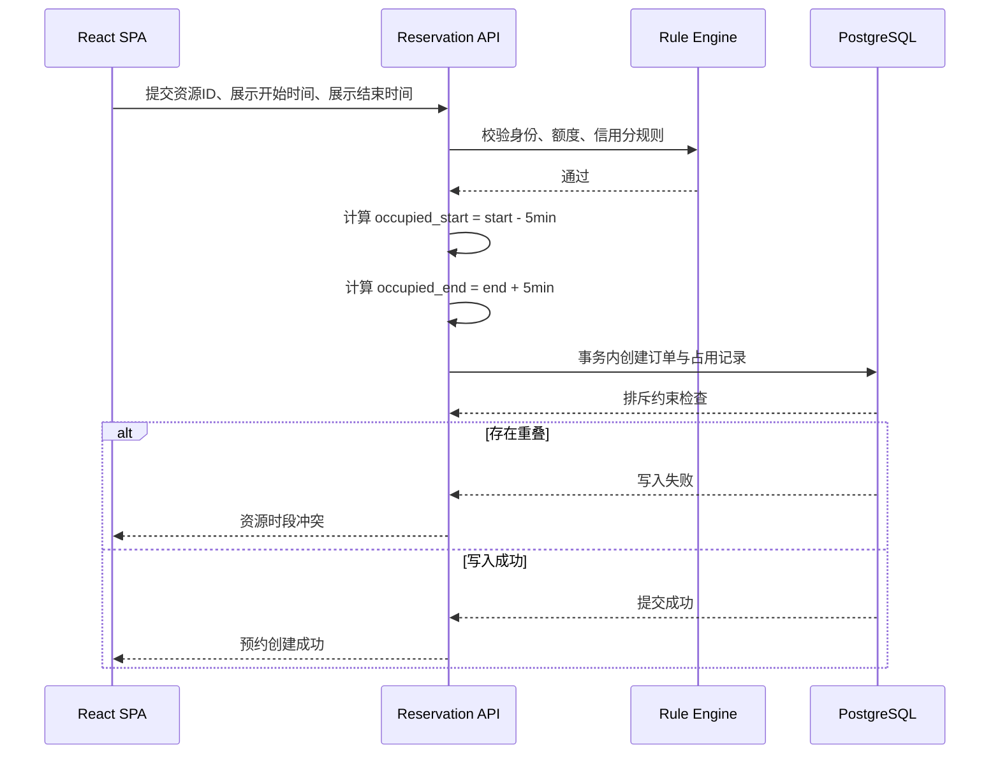
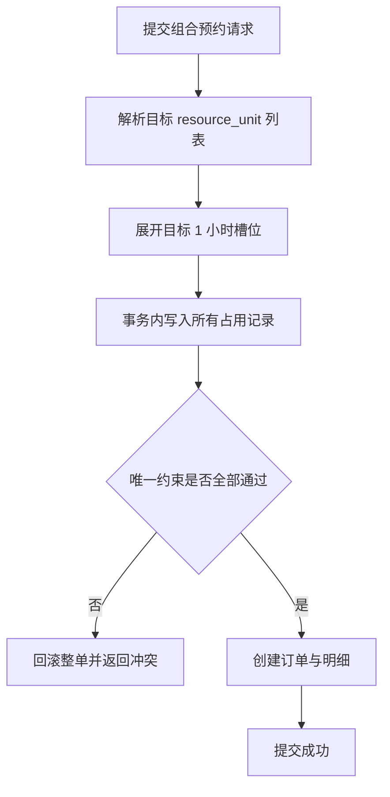
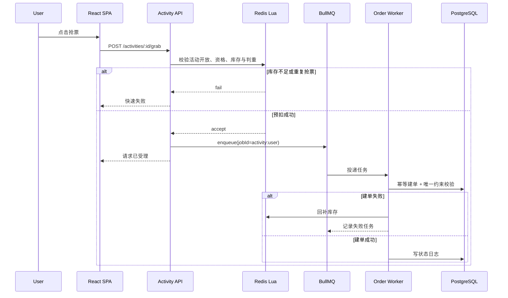
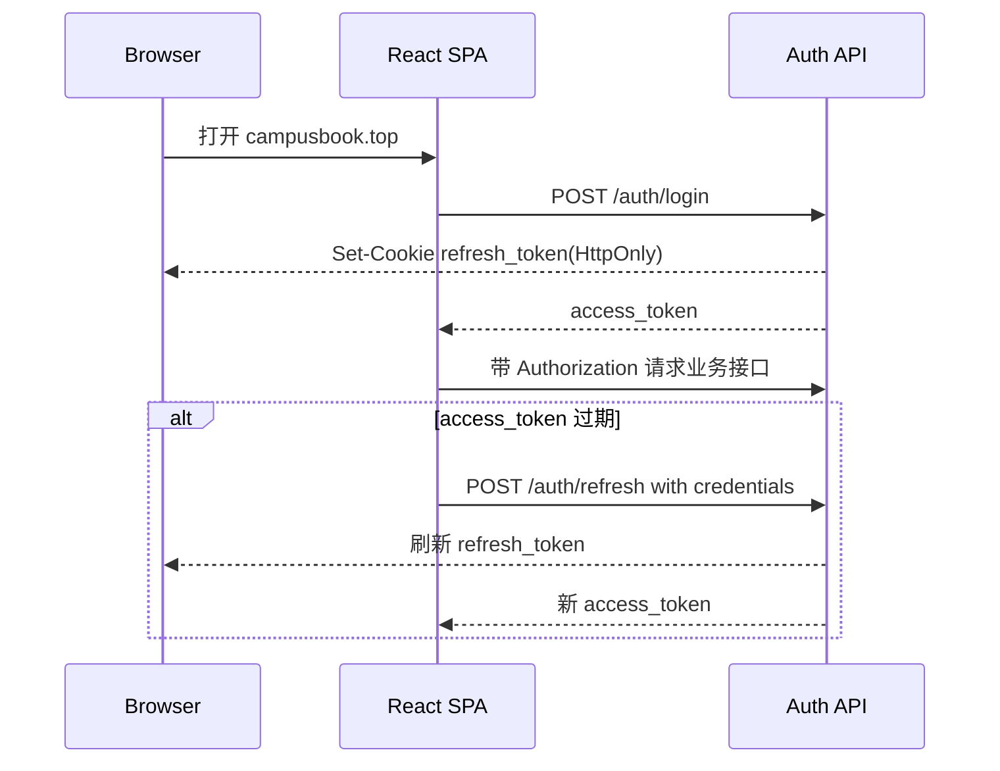
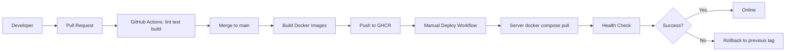

# Architecture Diagrams

本文件汇总当前推荐技术方案 V2 的关键架构图与流程图。

## 1. 单机系统总览

```mermaid
flowchart TB
    User[User Browser]
    Admin[Admin Browser]

    subgraph ECS[Alibaba Cloud ECS 47.251.174.28]
        Nginx[Nginx]
        Web[React Static Files]
        API[NestJS API]
        Worker[BullMQ Worker]
        PG[(PostgreSQL)]
        Redis[(Redis)]
    end

    User -->|campusbook.top| Nginx
    User -->|www.campusbook.top| Nginx
    Admin -->|campusbook.top/admin| Nginx
    User -->|api.campusbook.top| Nginx

    Nginx -->|server_name: campusbook.top www.campusbook.top| Web
    Nginx -->|server_name: api.campusbook.top| API
    API --> PG
    API --> Redis
    Worker --> Redis
    Worker --> PG
```

## 2. 学术空间预约冲突控制

```mermaid
sequenceDiagram
    participant FE as React SPA
    participant API as Reservation API
    participant Rule as Rule Engine
    participant DB as PostgreSQL

    FE->>API: 提交资源ID、展示开始时间、展示结束时间
    API->>Rule: 校验身份、额度、信用分规则
    Rule-->>API: 通过
    API->>API: 计算 occupied_start = start - 5min
    API->>API: 计算 occupied_end = end + 5min
    API->>DB: 事务内创建订单与占用记录
    DB-->>API: 排斥约束检查
    alt 存在重叠
        DB-->>API: 写入失败
        API-->>FE: 资源时段冲突
    else 写入成功
        DB-->>API: 提交成功
        API-->>FE: 预约创建成功
    end
```

## 3. 体育设施组合预约

```mermaid
flowchart TD
    A[提交组合预约请求] --> B[解析目标 resource_unit 列表]
    B --> C[展开目标 1 小时槽位]
    C --> D[事务内写入所有占用记录]
    D --> E{唯一约束是否全部通过}
    E -- 否 --> F[回滚整单并返回冲突]
    E -- 是 --> G[创建订单与明细]
    G --> H[提交成功]
```

## 4. 活动抢票高并发链路

```mermaid
sequenceDiagram
    participant User as User
    participant FE as React SPA
    participant API as Activity API
    participant Redis as Redis Lua
    participant Queue as BullMQ
    participant Worker as Order Worker
    participant DB as PostgreSQL

    User->>FE: 点击抢票
    FE->>API: POST /activities/:id/grab
    API->>Redis: 校验活动开放、资格、库存与判重
    alt 库存不足或重复抢票
        Redis-->>API: fail
        API-->>FE: 快速失败
    else 预扣成功
        Redis-->>API: accept
        API->>Queue: enqueue(jobId=activity:user)
        API-->>FE: 请求已受理
        Queue->>Worker: 投递任务
        Worker->>DB: 幂等建单 + 唯一约束校验
        alt 建单失败
            Worker->>Redis: 回补库存
            Worker-->>Queue: 记录失败任务
        else 建单成功
            Worker->>DB: 写状态日志
        end
    end
```

## 5. 登录与刷新令牌流程

```mermaid
sequenceDiagram
    participant Browser as Browser
    participant Web as React SPA
    participant API as Auth API

    Browser->>Web: 打开 campusbook.top
    Web->>API: POST /auth/login
    API-->>Browser: Set-Cookie refresh_token(HttpOnly)
    API-->>Web: access_token
    Web->>API: 带 Authorization 请求业务接口
    alt access_token 过期
        Web->>API: POST /auth/refresh with credentials
        API-->>Browser: 刷新 refresh_token
        API-->>Web: 新 access_token
    end
```

## 6. CI/CD 与部署流程

```mermaid
flowchart LR
    Dev[Developer] --> PR[Pull Request]
    PR --> CI[GitHub Actions: lint test build]
    CI --> Merge[Merge to main]
    Merge --> Build[Build Docker Images]
    Build --> GHCR[Push to GHCR]
    GHCR --> Deploy[Manual Deploy Workflow]
    Deploy --> Server[Server docker compose pull]
    Server --> Health[Health Check]
    Health --> Rollback{Success?}
    Rollback -- Yes --> Online[Online]
    Rollback -- No --> Previous[Rollback to previous tag]
```
