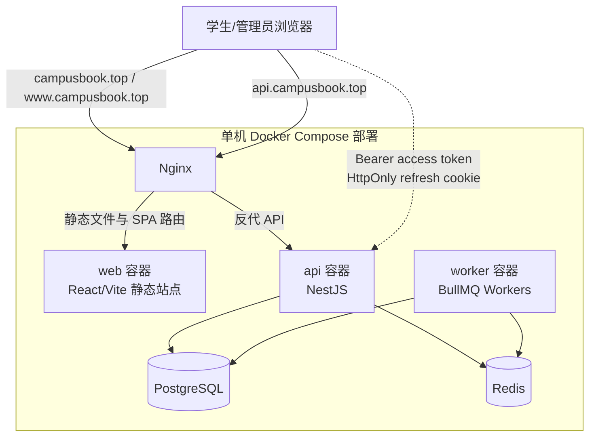
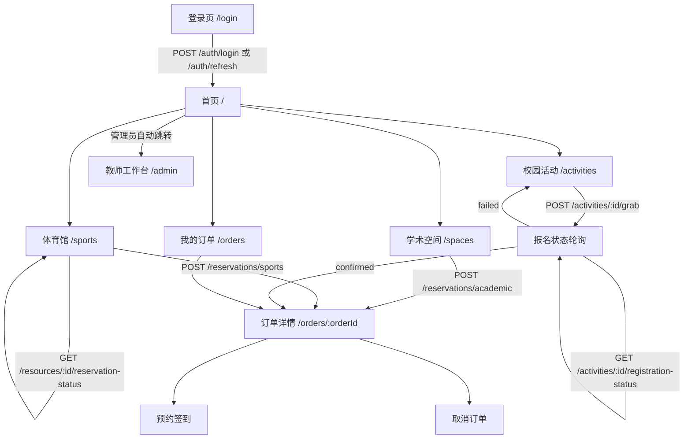
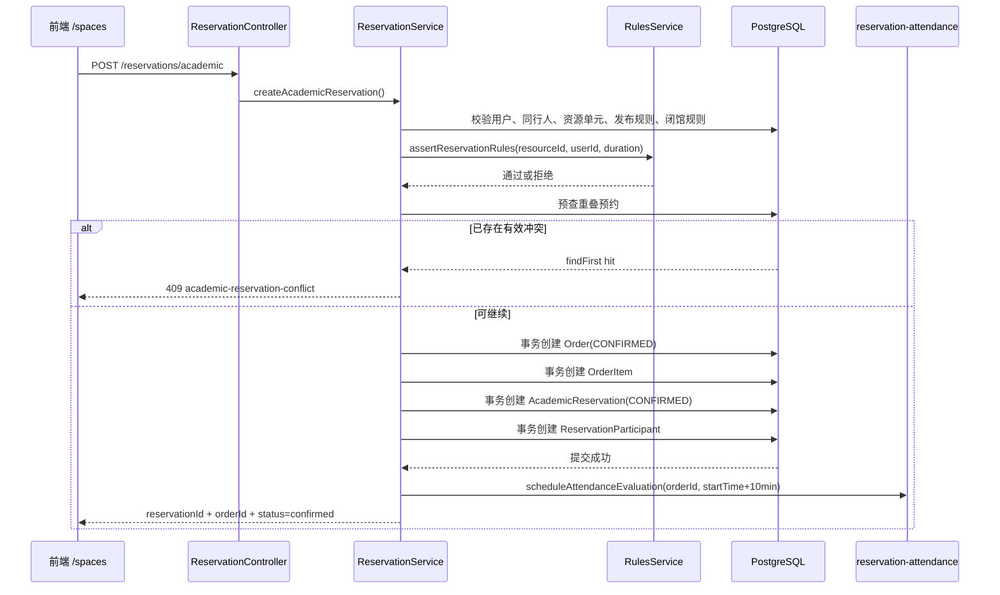
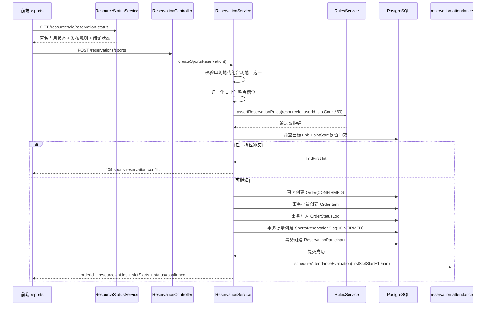
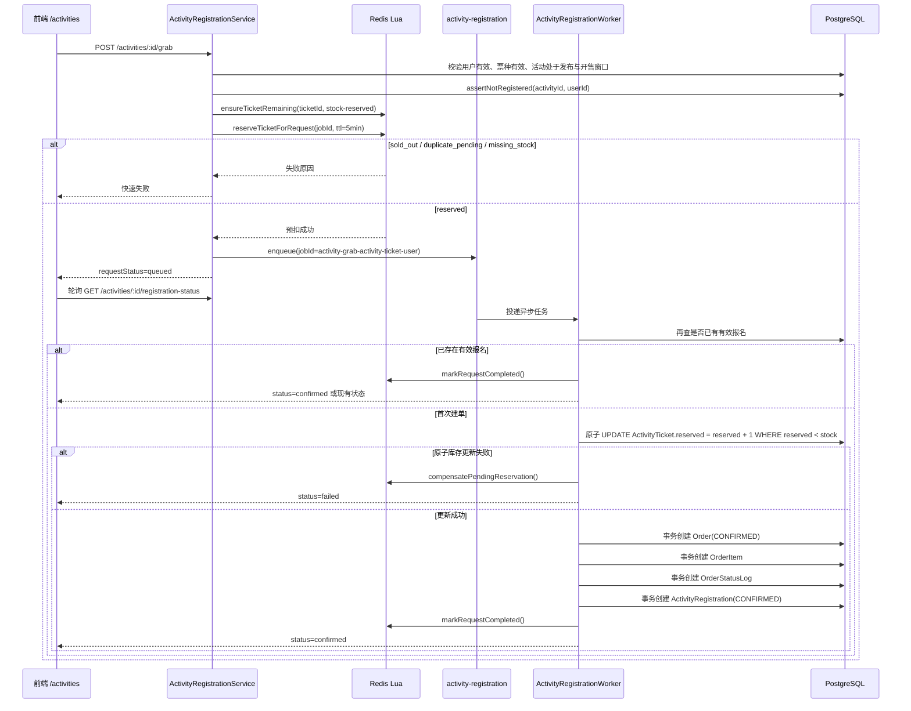
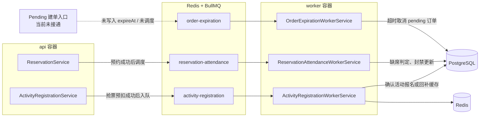
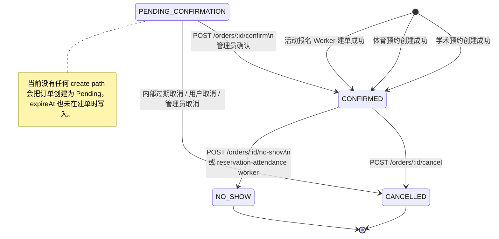

# Architecture Diagrams

本文件不再描述“推荐方案”，而是以当前仓库代码为准，汇总 2026-04-21 核对后的真实架构图与业务流程图。

核对范围主要来自：

- `apps/api/src/app.module.ts`
- `apps/api/src/worker.module.ts`
- `apps/api/prisma/schema.prisma`
- `apps/api/src/modules/reservation/`
- `apps/api/src/modules/activities/`
- `apps/api/src/modules/orders/`
- `apps/api/src/modules/rules/`
- `apps/web/src/routes.tsx`
- `apps/web/src/ui/pages/`
- `infra/docker-compose.yml`
- `infra/nginx/conf.d/campusbook.conf`

## 1. 当前运行时架构



说明：

- 前端与后台管理端共用同一个 SPA，管理员通过 `/admin` 进入工作台。
- 当前部署拓扑中 `worker` 与 `api` 为分离容器，异步任务不在 API 进程内消费。
- Nginx 只做域名分流和反向代理，业务逻辑全部落在 API 与 Worker。

## 2. 当前前端真实业务入口



说明：

- 学术空间页当前直接提交预约，不展示公共占用时间表。
- 体育页会先读取公开预约状态，再提交单场地或组合预约。
- 活动页不是同步下单成功，而是先进入排队状态，再轮询报名结果。

## 3. 学术空间预约真实时序



当前实现关键点：

- 学术预约不是先进入待支付，而是建单后直接 `CONFIRMED`。
- 业务层先做一次冲突预检，数据库层再由 `academic_reservation_no_overlap` 排斥约束兜底。
- 冲突范围使用 `startTime/endTime` 加前后各 `5` 分钟缓冲。

## 4. 体育设施预约真实时序



当前实现关键点：

- 组合预约在同一事务内批量写入，任一槽位失败会整单回滚。
- 数据库层由部分唯一索引 `sports_active_slot_unique` 保护有效占用。
- 体育预约同样是直接 `CONFIRMED`，没有待支付阶段。

## 5. 活动抢票并发处理真实时序



当前实现关键点：

- 热点入口已经真实使用 `Redis Lua + BullMQ + Worker + 数据库最终校验`。
- 当前没有单独的支付确认流程，活动报名建单成功后直接是 `CONFIRMED`。
- 同一用户对同一活动的有效报名由数据库部分唯一索引兜底。

## 6. 异步任务与 Worker 分工



当前实现关键点：

- `activity-registration` 队列正在被真实使用。
- `reservation-attendance` 队列正在被真实使用，用于签到超时后的缺席判定。
- `order-expiration` 队列已实现，但当前没有任何建单入口会写入 `expireAt` 或调度该队列。

## 7. 当前代码支持的订单状态机



当前实现关键点：

- 所有状态迁移都通过 `version` 做 CAS 更新，并写入 `OrderStatusLog`。
- 预约类子表与活动报名子表会在订单迁移时同步更新状态。
- 缺席判定会把订单转为 `NO_SHOW`，并为参与人累计预约违规次数。

## 8. 当前规则引擎执行路径

```mermaid
flowchart LR
    Reservation[ReservationService 创建预约]
    Resource[读取 Resource + RuleBindings]
    User[读取 User.role + creditScore]
    Normalize[normalizeRuleDefinition()]
    Evaluate[assertRuleSatisfied()]
    Pass[继续预约事务]
    Reject[抛出 BadRequest / Forbidden]

    Reservation --> Resource
    Reservation --> User
    Resource --> Normalize
    Normalize --> Evaluate
    User --> Evaluate
    Evaluate -->|通过| Pass
    Evaluate -->|不通过| Reject
```

当前实现关键点：

- 规则引擎当前只在预约创建路径上被调用，不覆盖活动报名或订单取消。
- 当前仅支持三类规则：
  - `min_credit_score`
  - `max_duration_minutes`
  - `allowed_user_roles`

## 9. 当前代码状态摘要

- 已真实落地：学术空间预约、体育设施单场地与组合预约、活动抢票并发处理、订单查询/取消、预约签到、缺席自动判定、资源发布规则与闭馆控制、管理员资源/活动/规则维护。
- 已有基础设施但当前未跑通主路径：`PENDING_CONFIRMATION` 订单创建、订单超时取消、支付回调、`PaymentRecord` 驱动的“幽灵支付”闭环。
- 与题面相比，当前代码额外实现了预约签到窗口、缺席自动判定、按预约类别封禁违规用户等机制。
