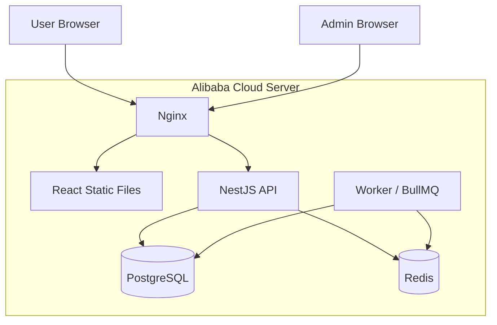
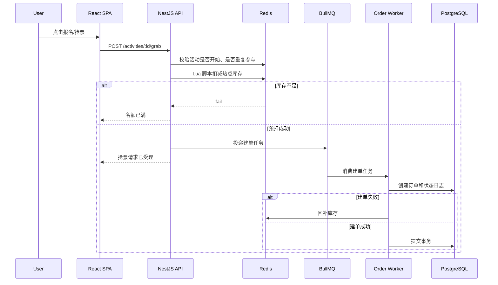
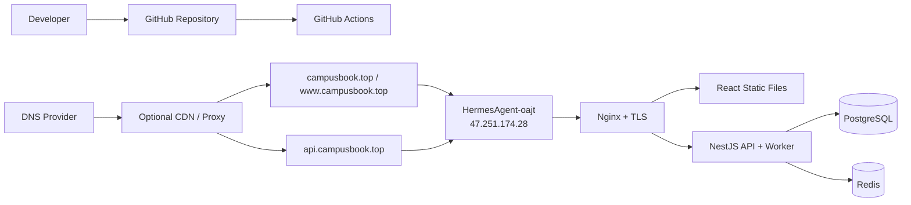
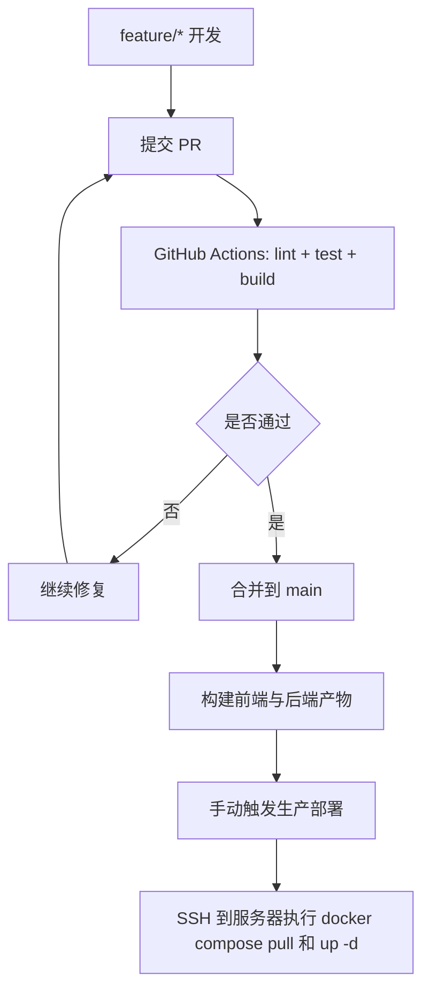

# 技术方案 V1

## 文档说明

本文件用于归档 2026-04-16 已讨论版本的首版技术方案。
内容尽量保持原意，只做排版整理。
本版作为基线存档，不作为当前默认推荐实现。
当前推荐实现请参考 `technical-solution-v2.md`。

## 1. 方案目标

在严格服从比赛 PDF 的前提下，构建一个可交付、可演示、可扩展的校园预约与活动平台，满足以下现实边界：

- React 前端构建产物部署到阿里云单台服务器
- 后端、数据库、缓存与异步任务也部署到同一台阿里云单台服务器
- 支撑学术空间预约、体育设施预约、校园活动抢票三类核心业务
- 支撑复杂订单状态机、动态规则引擎和高并发活动场景

## 2. 硬约束与设计原则

### 2.1 硬约束

- 有争议时，以 `docs/reference/第一届百块奖金web大赛-技术赛道.pdf` 为准
- 所有正式文档必须服从 PDF，而不是反过来
- 阿里云服务器承载前端、后端与数据层
- 正式环境必须使用域名和 HTTPS，不长期暴露裸 IP 作为主访问入口
- 当前域名结构固定为：`campusbook.top`、`www.campusbook.top`、`api.campusbook.top`

### 2.2 设计原则

- 单机优先：先让方案在 2C2G 机器上稳定跑通
- 分层清晰：前端、API、数据、异步任务边界明确
- 小步演进：先完成比赛要求，再考虑复杂拆分
- 高并发只在热点路径做强化，不全链路过度设计
- 一切关键状态变更都可审计、可追踪、可回放

## 3. 推荐技术栈

### 3.1 前端

- `React + TypeScript + Vite`
- 路由：`React Router`
- 数据请求：`TanStack Query`
- 本地状态：`Zustand`
- UI：`Tailwind CSS` + 组件封装

推荐理由：

- React 满足用户指定要求
- Vite 构建快，适合产出静态资源并由 Nginx 直接托管
- TypeScript 能减少前后端接口漂移
- TanStack Query 适合预约、订单、活动列表等读写场景

首版路由建议：

- 默认采用 `BrowserRouter`
- 由 Nginx 配置 SPA fallback，将非文件请求回退到 `index.html`

### 3.2 后端

- `NestJS + TypeScript`
- ORM：`Prisma`
- 参数校验：`class-validator`
- 队列：`BullMQ`

推荐理由：

- 与 React 共用 TypeScript，降低上下文切换成本
- NestJS 模块化适合用户、资源、订单、规则引擎等边界拆分
- BullMQ 基于 Redis，可同时处理削峰、异步通知、延迟取消任务

### 3.3 数据与基础设施

- 数据库：`PostgreSQL`
- 缓存与队列：`Redis`
- 反向代理与 TLS：`Nginx`
- 编排：`Docker Compose`
- CI/CD：`GitHub Actions`

## 4. 系统分层与模块职责

### 4.1 应用模块

- `auth`：登录、注册、鉴权、角色控制
- `resource`：资源主数据、资源单元、体育组合场地
- `reservation`：学术空间与体育设施预约校验
- `activity`：活动发布、详情展示、抢票入口
- `order`：统一订单创建、状态流转、支付与取消
- `rule-engine`：额度、身份、信用分、惩罚规则
- `notification`：站内消息、短信或邮件留接口
- `admin`：资源维护、活动维护、规则配置、数据看板
- `jobs`：超时取消、库存回写、异步通知、对账补偿

### 4.2 分层关系图



### 4.3 域名与入口路由

- `campusbook.top`：前端站点
- `www.campusbook.top`：前端站点
- `api.campusbook.top`：后端 API

当前 Nginx 入口策略：

- 使用 `server_name` 区分前端和后端
- 前端由 Nginx 直接提供静态文件
- 后端反向代理到 `127.0.0.1:3000`
- 当前先走 HTTP，后续通过增加 443 配置平滑切 HTTPS

## 5. 关键业务设计

### 5.1 学术空间预约

- 资源是原子化资源，不可拆分
- 用户选择连续时间段
- 后端在校验时自动扩展前后各 5 分钟缓冲
- 冲突判断以“预约有效时间 + 缓冲时间”作为实际占用区间

推荐实现：

- 下单前先根据资源 ID 和时间区间做冲突校验
- 订单确认前持久化预约明细
- 取消或超时后释放占用

### 5.2 体育设施预约

- 使用 1 小时离散槽位模型
- 单资源预约与组合资源预约统一走资源单元校验
- 组合预约只要有任一资源单元冲突，则整单失败

推荐实现：

- 为体育场地预生成槽位视图或用查询实时聚合
- 组合预约在事务内完成全部资源单元的占用校验

### 5.3 校园活动抢票

- 活动入口先打到 Redis，不直接把尖峰流量打进数据库
- Redis 负责热点库存、资格判重和快速失败
- 成功请求进入 BullMQ 队列异步落单
- 数据库承担最终一致性确认

### 5.4 订单状态机

- `待支付/确认`
- `已确认`
- `已取消`
- `已爽约`

关键保护：

- 超时取消由延迟任务触发
- 支付回调与超时取消都基于旧状态 CAS 更新
- 所有状态变更写入状态日志

## 6. 高并发抢票时序图



## 7. 部署拓扑图



## 8. 仓库结构建议

```text
.
├── apps/
│   ├── web/
│   └── api/
├── packages/
│   ├── shared-types/
│   └── eslint-config/
├── infra/
│   ├── docker-compose.yml
│   └── nginx/
├── docs/
└── .github/workflows/
```

建议使用 `pnpm workspace` 管理 monorepo，理由是：

- 前后端共享 TypeScript 类型更容易
- CI 可以按应用拆分执行
- 文档、脚本、基础设施配置集中管理

## 9. Git 与发布流程

### 9.1 分支策略

- `main`：始终保持可发布
- `feature/*`：功能开发
- `docs/*`：文档与图示更新
- `fix/*`：缺陷修复

### 9.2 发布流程图



### 9.3 CI/CD 建议

- 前端：合并 `main` 后自动执行 lint、test、build
- 后端：合并 `main` 后自动执行测试和镜像构建
- 生产部署：建议使用手动触发工作流，避免每次 merge 都直接改线上

## 10. 安全与质量要求落地

- 鉴权使用 JWT + 刷新令牌机制
- 前后端统一做输入校验
- 所有资源接口做对象级权限校验，防止越权
- 数据库使用参数化查询和 ORM 约束，防止 SQL 注入
- 富文本或可展示字符串输出前做 XSS 防护
- 前端不保存任何服务端密钥
- 关键操作写审计日志

## 11. 性能与容量控制

### 11.1 单机阶段的容量策略

- PostgreSQL、Redis、API、Worker 放在同一台机器
- React 构建产物直接由 Nginx 托管
- 将高并发活动流量先吸收到 Redis，再异步落单

### 11.2 资源保护策略

- 对抢票接口做限流
- 对热点活动启用 Redis 预热
- 对订单写入和状态变更加幂等键
- 对后台管理接口启用更严格权限策略

## 12. 里程碑建议

### Milestone 1: 基础骨架

- monorepo 初始化
- React 前端与 NestJS 后端可独立启动
- Docker Compose 跑通 PostgreSQL、Redis、API

### Milestone 2: 预约主流程

- 用户登录
- 学术空间预约
- 体育设施预约
- 统一订单表与状态流转

### Milestone 3: 活动抢票与规则引擎

- 热门活动抢票
- Redis 预扣库存
- BullMQ 异步建单
- 动态规则引擎初版

### Milestone 4: 管理端与上线

- 管理后台
- 日志和基础监控
- 域名、HTTPS 与 Nginx 反代配置
- 阿里云服务器生产部署

## 13. 当前必须注意的风险

- 若继续使用裸 IP 而没有域名，HTTPS、Cookie 和缓存策略都会变复杂
- 2 GiB 内存不适合同时堆很多重型组件，首版应避免引入额外消息中间件
- 若主要访问人群位于中国大陆，需要额外验证海外源站与 CDN 链路的可达性和时延
- 当前虽然已完成域名解析，但 HTTPS 证书与 443 配置仍未启用
- 正式开发前，仍需人工将最终方案与 PDF 再做一次逐条校对
