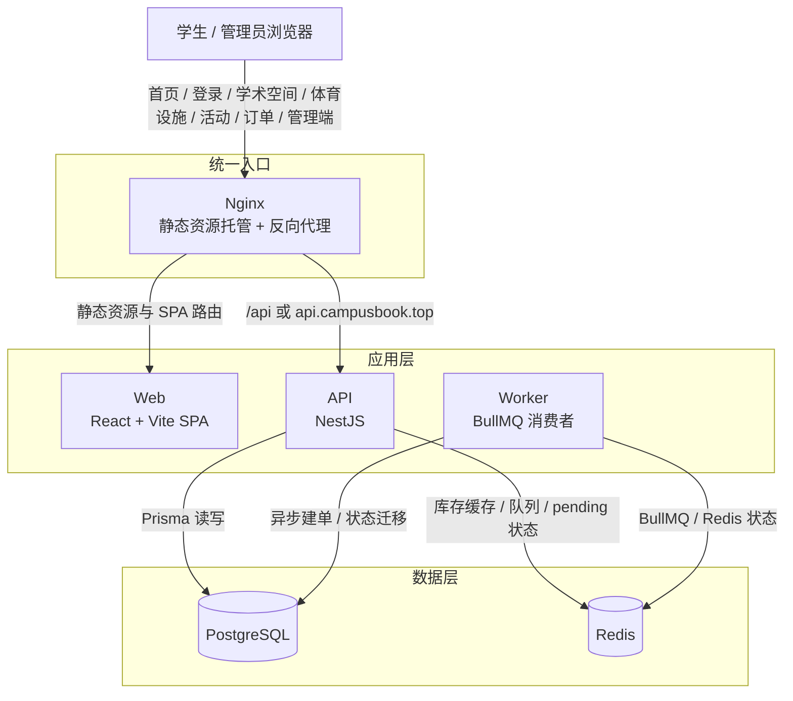

# 核心架构图

## 总览

## 组件职责

- `Web`：一个前端应用同时承载学生端和 `/admin` 管理端。
- `API`：负责登录、资源读取、预约创建、活动报名、订单管理、规则校验、通知和工单等接口。
- `Worker`：负责活动报名异步建单、订单超时取消、预约签到缺席判定、活动库存恢复。
- `PostgreSQL`：保存用户、资源、活动、订单、预约、规则、支付记录等最终数据。
- `Redis`：负责活动库存缓存、请求 pending 状态和 BullMQ 队列。
- `Nginx`：负责统一入口、静态资源托管和 API 转发。

## 当前后端模块

- 认证与会话：`auth`
- 资源管理与预约状态：`resource`
- 学术 / 体育预约：`reservation`
- 活动与抢票：`activities`
- 订单中心与状态机：`orders`
- Mock 支付：`payment`
- 规则中心：`rules`
- 通知：`notifications`
- 工单：`service-requests`

## 当前 Worker 任务

- 活动报名异步建单
- 订单超时取消
- 预约签到 / 缺席判定
- 活动库存恢复

## 当前实现边界

- 学术空间和体育设施预约创建后直接进入 `CONFIRMED`。
- 活动报名分为两类：免费票直接确认，付费票进入 `PENDING_CONFIRMATION`，再通过 Mock 支付确认。
- 当前未接入真实校园统一身份认证，支付也不是第三方真实支付网关。
