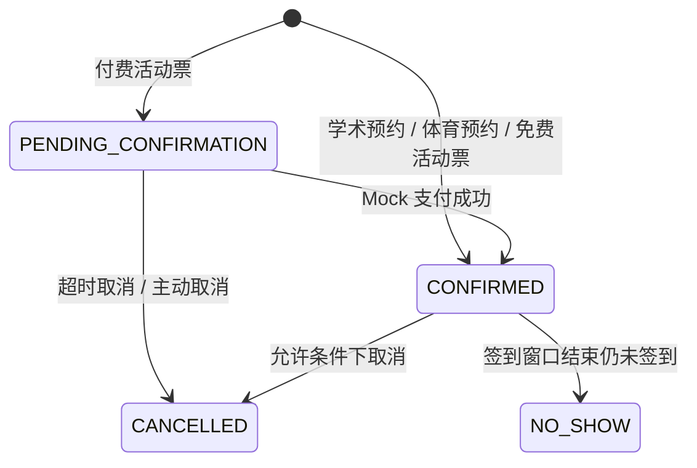

# 业务流程图

本文只保留当前仓库最重要的三条主业务流，并额外补一张统一订单状态图。

## 1. 学术空间预约

```mermaid
flowchart TD
    A[学生登录] --> B[进入 /spaces]
    B --> C[选择资源单元与连续时间段]
    C --> D[提交 POST /reservations/academic]
    D --> E[校验资源状态、发布规则、闭馆规则]
    E --> F[规则引擎校验]
    F --> G{前后 5 分钟缓冲后是否冲突}
    G -- 是 --> H[返回冲突，预约失败]
    G -- 否 --> I[创建 Order(CONFIRMED)]
    I --> J[创建 AcademicReservation(CONFIRMED)]
    J --> K[写入 ReservationParticipant]
    K --> L[调度签到 / 缺席判定任务]
    L --> M[在订单详情页查看结果]
```

说明：

- 学术空间按连续时间段预约。
- 冲突判断不仅看用户选中的时段，还会把前后各 `5` 分钟缓冲一起纳入判断。

## 2. 体育设施预约

```mermaid
flowchart TD
    A[学生登录] --> B[进入 /sports]
    B --> C[读取公开预约状态]
    C --> D[选择单场地或组合场地]
    D --> E[选择 1 小时槽位]
    E --> F[提交 POST /reservations/sports]
    F --> G[校验资源状态、发布规则、闭馆规则]
    G --> H[规则引擎校验]
    H --> I{任一场地任一槽位是否冲突}
    I -- 是 --> J[整单失败]
    I -- 否 --> K[创建 Order(CONFIRMED)]
    K --> L[批量创建 SportsReservationSlot(CONFIRMED)]
    L --> M[写入 ReservationParticipant]
    M --> N[调度签到 / 缺席判定任务]
    N --> O[在订单详情页查看结果]
```

说明：

- 体育设施按离散槽位预约，不是连续时间段。
- 支持组合场地，只要任一槽位冲突，整单就会失败。

## 3. 校园活动报名 / 抢票

```mermaid
flowchart TD
    A[学生登录] --> B[进入 /activities]
    B --> C[选择活动和票种]
    C --> D[提交 POST /activities/:id/grab]
    D --> E[校验活动状态、用户资格、活动规则]
    E --> F[Redis 预扣库存]
    F --> G[写入 BullMQ 队列]
    G --> H[Worker 异步建单]
    H --> I{票种价格是否大于 0}
    I -- 否 --> J[创建 Order(CONFIRMED)]
    I -- 是 --> K[创建 Order(PENDING_CONFIRMATION)]
    K --> L[创建 PaymentRecord(PENDING)]
    K --> M[调度订单过期任务]
    J --> N[创建 ActivityRegistration]
    L --> N
    N --> O[前端轮询报名状态]
    O --> P{是否完成支付}
    P -- 免费票 / 已支付 --> Q[订单进入 CONFIRMED]
    P -- 待支付 --> R[调用 Mock 支付接口]
    R --> S[支付回调确认订单]
    S --> Q
    M --> T{超时未支付}
    T -- 是 --> U[订单取消并回补库存]
```

说明：

- 热门活动不是直接同步下单，而是先走 `Redis + BullMQ + Worker`。
- 当前仓库里的支付是 Mock 支付，用于演示订单状态机和超时取消链路。

## 4. 统一订单状态



说明：

- `PENDING_CONFIRMATION` 目前主要用于付费活动票。
- `NO_SHOW` 主要出现在学术和体育预约，由 Worker 根据签到窗口自动判定。
