# 数据库 ER 图

本文只保留当前仓库最核心的业务实体，方便快速理解数据结构。

```mermaid
erDiagram
    USER {
        string id PK
        string email UK
        string role
        string status
        int creditScore
    }

    RESOURCE {
        string id PK
        string code UK
        string type
        string status
    }

    RESOURCE_UNIT {
        string id PK
        string resourceId FK
        string code UK
        string availabilityMode
    }

    RESOURCE_GROUP {
        string id PK
        string resourceId FK
        string name
    }

    RESOURCE_GROUP_ITEM {
        string id PK
        string groupId FK
        string resourceUnitId FK
    }

    ACTIVITY {
        string id PK
        string title
        string status
        int totalQuota
    }

    ACTIVITY_TICKET {
        string id PK
        string activityId FK
        string name
        int stock
        int reserved
        int priceCents
    }

    ORDER {
        string id PK
        string orderNo UK
        string userId FK
        string activityId FK
        string bizType
        string status
        int version
        datetime expireAt
    }

    ORDER_ITEM {
        string id PK
        string orderId FK
        string resourceId FK
        string resourceUnitId FK
        string activityTicketId FK
    }

    ACADEMIC_RESERVATION {
        string id PK
        string orderId FK
        string userId FK
        string resourceId FK
        string resourceUnitId FK
        datetime startTime
        datetime endTime
        string status
    }

    SPORTS_RESERVATION_SLOT {
        string id PK
        string orderId FK
        string userId FK
        string resourceId FK
        string resourceUnitId FK
        datetime slotStart
        datetime slotEnd
        string status
    }

    ACTIVITY_REGISTRATION {
        string id PK
        string orderId FK
        string activityId FK
        string activityTicketId FK
        string userId FK
        string status
    }

    PAYMENT_RECORD {
        string id PK
        string orderId FK
        string payStatus
        string transactionNo UK
        int amountCents
    }

    ORDER_STATUS_LOG {
        string id PK
        string orderId FK
        string fromStatus
        string toStatus
        string reason
    }

    RULE {
        string id PK
        string ruleType
        string name
        string status
    }

    RESOURCE_RULE_BINDING {
        string id PK
        string resourceId FK
        string ruleId FK
    }

    USER_CREDIT_LOG {
        string id PK
        string userId FK
        int scoreDelta
        string reason
    }

    USER_RESERVATION_RESTRICTION {
        string id PK
        string userId FK
        string category
        int violationCount
        datetime bannedUntil
    }

    USER ||--o{ ORDER : places
    USER ||--o{ ACADEMIC_RESERVATION : creates
    USER ||--o{ SPORTS_RESERVATION_SLOT : books
    USER ||--o{ ACTIVITY_REGISTRATION : registers
    USER ||--o{ USER_CREDIT_LOG : owns
    USER ||--o{ USER_RESERVATION_RESTRICTION : receives

    RESOURCE ||--o{ RESOURCE_UNIT : contains
    RESOURCE ||--o{ RESOURCE_GROUP : owns
    RESOURCE_GROUP ||--o{ RESOURCE_GROUP_ITEM : contains
    RESOURCE_UNIT ||--o{ RESOURCE_GROUP_ITEM : joins

    RESOURCE ||--o{ ACADEMIC_RESERVATION : reserved_by
    RESOURCE_UNIT ||--o{ ACADEMIC_RESERVATION : occupied_by
    RESOURCE ||--o{ SPORTS_RESERVATION_SLOT : reserved_by
    RESOURCE_UNIT ||--o{ SPORTS_RESERVATION_SLOT : occupied_by

    ACTIVITY ||--o{ ACTIVITY_TICKET : offers
    ACTIVITY ||--o{ ORDER : generates
    ACTIVITY ||--o{ ACTIVITY_REGISTRATION : has
    ACTIVITY_TICKET ||--o{ ACTIVITY_REGISTRATION : chosen_by
    ACTIVITY_TICKET ||--o{ ORDER_ITEM : referenced_by

    ORDER ||--o{ ORDER_ITEM : contains
    ORDER ||--|| ACADEMIC_RESERVATION : wraps
    ORDER ||--o{ SPORTS_RESERVATION_SLOT : wraps
    ORDER ||--|| ACTIVITY_REGISTRATION : wraps
    ORDER ||--o{ ORDER_STATUS_LOG : logs
    ORDER ||--o{ PAYMENT_RECORD : has

    RULE ||--o{ RESOURCE_RULE_BINDING : binds
    RESOURCE ||--o{ RESOURCE_RULE_BINDING : uses
```

## 结构说明

- `Order` 是统一订单中心。学术预约、体育预约、活动报名都会收敛到这里。
- 学术空间和体育设施不是同一种占用模型：
  - 学术空间使用 `AcademicReservation` 表示连续时间段。
  - 体育设施使用 `SportsReservationSlot` 表示离散槽位。
- 活动报名由 `Activity`、`ActivityTicket`、`ActivityRegistration` 组成，付费票再关联 `PaymentRecord`。
- 规则系统由 `Rule + ResourceRuleBinding` 组成，资源预约按资源绑定规则执行。

## 当前关键约束

- 学术空间存在数据库层防重叠约束，保证同一资源单元在缓冲区内不能重叠预约。
- 体育设施对有效槽位建立唯一性保护，保证同一场地同一槽位不能被两张有效订单同时占用。
- 活动报名对同一用户的有效报名做唯一性保护，并用库存字段和 Worker 共同防止超卖。

## 为了可读性省略的表

- `ReservationParticipant`
- `UserRuleProfile`
- `PaymentCompensationLog`
- `Notification`
- `ServiceRequest`

这些表当前仓库中都已存在，但不是理解主链路所必需的核心实体。
