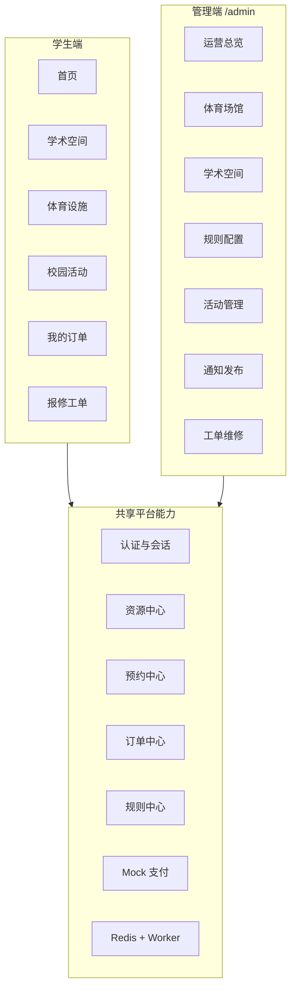

# 产品架构说明

## 1. 项目定位

`CampusBook` 是一个面向校园场景的统一预约与活动平台。它不是单一场地预约网站，而是把三类常见校园业务放进同一套产品里：

- 学术空间预约
- 体育设施预约
- 校园活动报名 / 抢票

这三类业务共享登录、订单中心、规则拦截和后台管理，但在预约模型上各自独立，避免把不同业务硬塞进同一种流程。

## 2. 用户角色

当前系统有两类正式角色：

- `STUDENT`：学生用户，可登录、预约资源、报名活动、查看和取消自己的订单。
- `ADMIN`：管理员用户，可进入 `/admin`，维护资源、活动、规则、通知和工单。

当前仓库没有开放注册，也没有接入真实校园统一身份认证，主要通过演示账号和已有用户数据登录。

## 3. 产品模块划分

## 4. 学生端结构

- 首页：提供学生主入口和主要业务导航。
- 学术空间：按连续时间段预约，适合讨论室、学习空间等资源。
- 体育设施：按 `1` 小时槽位预约，支持单场地和组合场地。
- 校园活动：支持活动浏览、抢票、报名状态查询和订单查看。
- 我的订单：统一查看学术预约、体育预约、活动报名的结果和状态。
- 报修工单：学生可提交服务请求，管理员在后台处理。

## 5. 管理端结构

当前 `/admin` 工作台按业务模块分区，不是一个把所有表单堆在一起的单页：

- 运营总览：查看后台入口和当前业务概况。
- 体育场馆：维护体育资源、资源单元、组合资源和开放状态。
- 学术空间：维护学术资源、资源单元、发布规则和闭馆规则。
- 规则配置：维护规则定义和资源绑定关系。
- 活动管理：维护活动、票种、状态和配额。
- 通知发布：维护首页通知内容。
- 工单维修：处理学生提交的报修工单。

## 6. 平台层设计

### 6.1 统一订单中心

三条主业务线最终都进入同一个订单中心：

- 学术预约对应 `AcademicReservation`
- 体育预约对应 `SportsReservationSlot`
- 活动报名对应 `ActivityRegistration`

这样做的好处是，用户只需要在一个地方看订单，后台也只需要围绕一套状态机管理确认、取消、缺席和支付相关动作。

### 6.2 区分不同预约模型

这个项目和普通预约网站最大的不同，是没有把所有业务强行做成同一种预约方式：

- 学术空间：连续时间段 + 前后 `5` 分钟缓冲
- 体育设施：离散槽位 + 组合预约
- 校园活动：库存驱动 + 异步建单 + 可进入待支付状态

这样的拆分更贴近真实业务，也更容易在数据库层加上对应约束。

### 6.3 规则中心

当前规则系统支持：

- 用户角色限制
- 信用分限制
- 预约时长限制
- 最大可预约次数限制
- 缺席后的扣分和限制处理

其中资源预约规则通过资源绑定执行；活动报名规则则按当前启用规则做资格校验。

### 6.4 活动并发处理

活动报名不是普通表单提交后立即写库，而是分成两段：

1. API 先做资格校验和 Redis 预扣库存
2. Worker 再异步完成最终建单和状态落库

这样做是为了在热门活动场景下减少数据库直接承受的瞬时压力，并降低超卖风险。

## 7. 当前实现边界

为了和普通宣传文案区分开，下面明确写当前仓库的真实边界：

- 已实现统一订单状态机、活动异步抢票、规则校验、管理端工作台。
- 学术空间和体育设施当前不走支付流程，创建后直接确认。
- 付费活动票支持 Mock 支付、超时取消和支付后确认。
- 当前未接入真实校园 SSO，也未接入真实第三方支付网关。

## 8. 为什么这个项目不只是“预约网站”

如果只是普通预约网站，通常只需要“资源列表 + 时间选择 + 下单”。

`CampusBook` 的不同点在于：

- 同时处理学术空间、体育设施、校园活动三种不同业务。
- 不同业务有不同的冲突控制方式和数据模型。
- 活动链路加入了库存、队列、Worker 和待支付状态。
- 后台不仅能维护资源，还能维护规则、活动、通知和工单。

因此，它更接近一个校园服务平台，而不是单一资源预约页。
