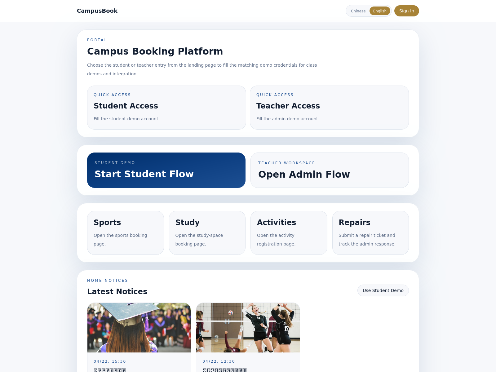
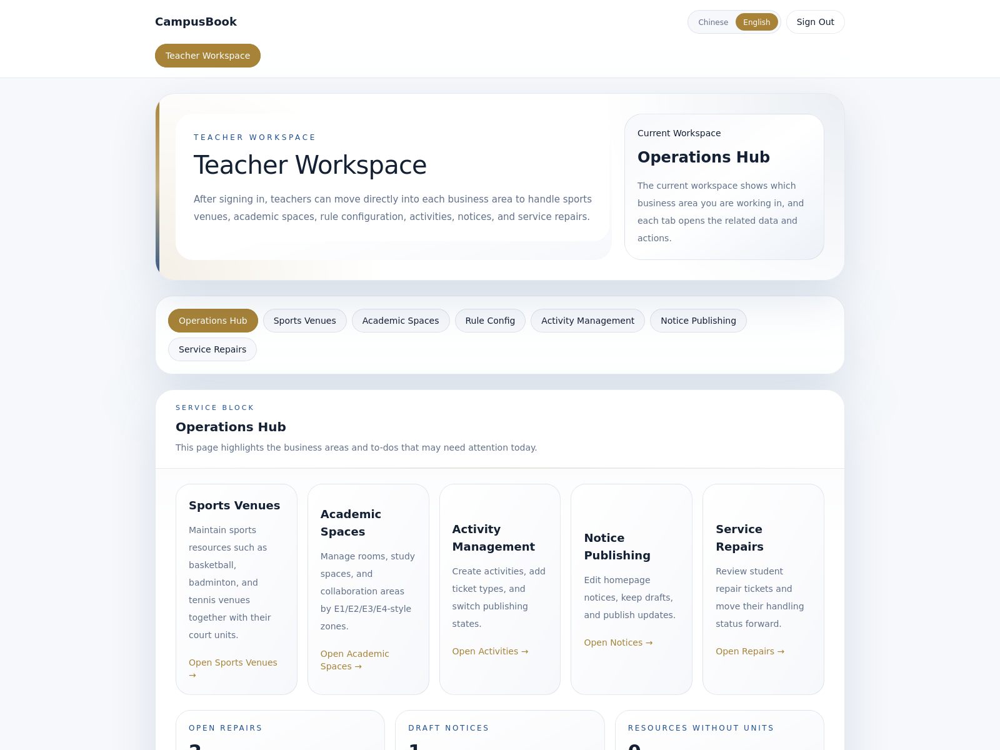
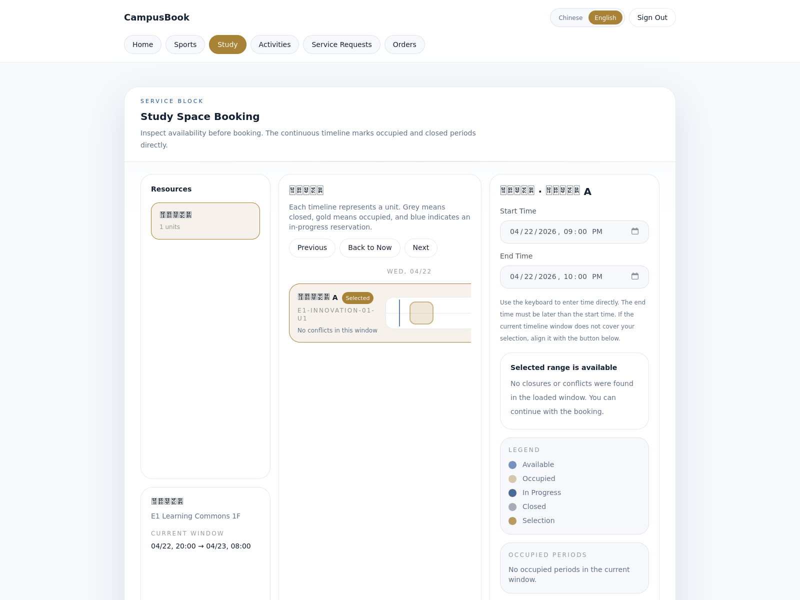
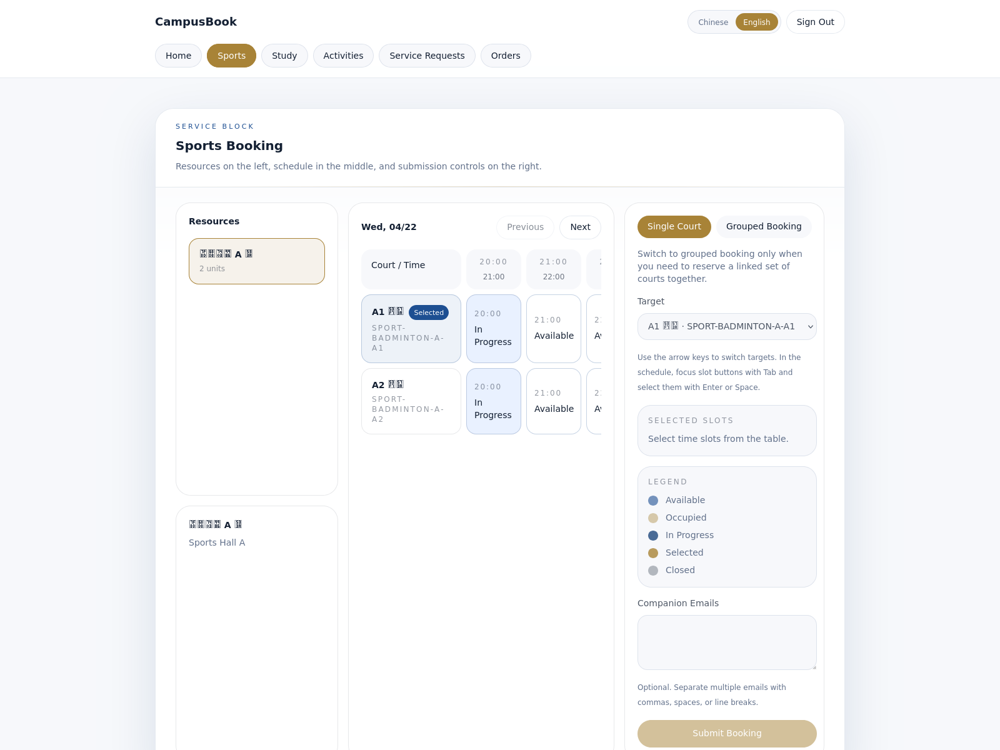
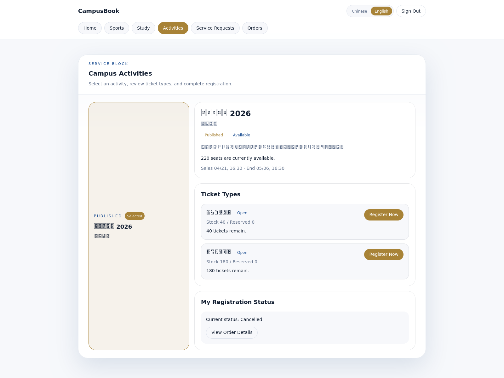
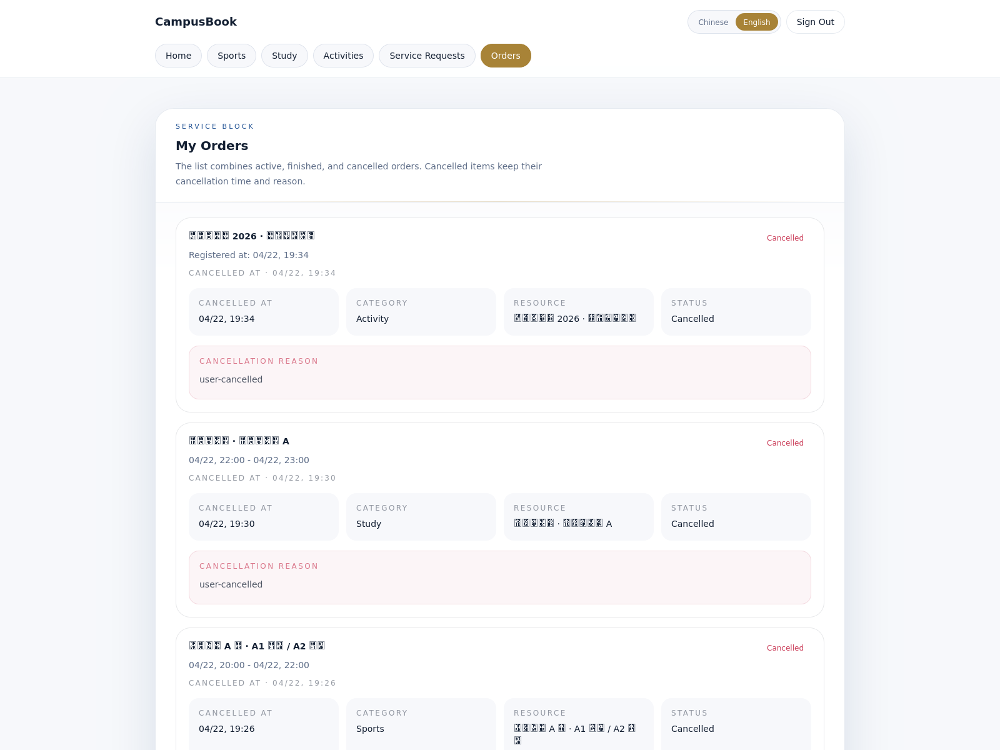

# 产品架构说明文档

## 配套图索引

- 附图 1：[核心架构图](./core-architecture-diagram.md)
- 附图 2：[业务流程图](./business-flow-diagram.md)
- 附图 3：[数据库 ER 图](./database-er-diagram.md)

# 1. 项目概述

CampusBook 是一个面向校园场景的统一预约与活动平台，覆盖三类核心业务：

- 学术空间预约
- 体育设施预约
- 校园活动报名与抢票

校园里的空间、场地和活动都存在高频使用的特点，但三类业务的预约方式、冲突规则和状态变化并不相同。若只用统一表单处理，容易出现时间冲突、资源重复占用、热门活动超发，以及支付与取消状态冲突等问题。

这个项目希望在同一平台里同时解决三件事：

- 让学生用同一入口完成预约、报名、查看订单和后续处理
- 让管理员可以统一维护资源、活动和规则
- 让系统在高并发、冲突判断和状态变化下仍然保持结果正确

它的重点放在四个问题上：资源差异如何建模、冲突如何拦截、热点场景如何防超卖、状态变化如何保持一致。这也是整份架构设计的出发点。

# 2. 产品设计

从用户视角看，平台拆成五个清楚的模块，避免把所有业务堆在一个页面里。

- 学术空间预约：面向自习室、讨论室等资源，用户按连续时间段预约，适合学习和协作类使用场景。
- 体育设施预约：面向球场、训练场等资源，用户按标准时段预约，也支持一次选择多个关联场地。
- 校园活动报名/抢票：面向讲座、比赛、演出等活动，支持票种、库存、报名状态和热门活动下的排队处理。
- 订单与状态管理：所有预约和报名最终都收口到统一订单中心，便于用户查看状态、取消订单、签到和支付。
- 后台管理：教师工作台已覆盖运营总览、体育场馆、学术空间、规则配置、活动管理、通知发布和工单维修等模块。

这种拆分带来两个直接结果：

- 用户路径清楚。学生不需要理解后台结构，只需要按“学术空间、体育设施、校园活动、我的订单”完成主流程。
- 业务边界清楚。不同资源保留各自规则，不会为了统一界面而把底层逻辑混成一套模糊规则。

# 3. 核心业务设计

本节对应附图 2：[业务流程图](./business-flow-diagram.md)。

## 3.1 学术空间

学术空间采用连续时间预约，不使用固定整点槽位。自习室、讨论室这类资源更符合“几点到几点”的使用方式，连续时间模型也更接近真实场景。

本项目在学术空间中加入了“前后各 5 分钟缓冲”机制，具体做法是：

- 用户看到并选择的是自己的实际使用时间
- 系统在冲突判断时，会自动把这个时间段向前和向后各扩 5 分钟

这样设计主要解决交接时段过于贴近的问题，避免上一组刚结束、下一组立刻进入。用户侧的直接体验是：

- 页面可以看到连续时间的占用情况
- 系统会提前拦截贴边冲突，避免等提交后才发现问题
- 精确边界可解释，例如贴边 4 分钟会判冲突，贴边 5 分钟可以放行

冲突判断必须落到后端和数据库层，而不能只靠前端提示。并发提交时，只有数据库最终约束才能保证“同一房间同一时段只能成功一单”。这也是本项目与普通预约表单系统的关键区别。

## 3.2 体育设施

体育设施采用按 `1` 小时 slot 预约，不使用连续时间段。体育场馆通常按标准时段开放，整点预约更便于学生选择，也更便于管理员排班和统计。

本项目把体育预约分为两种模式：

- 单个资源：预约一个具体场地
- 组合资源：一次预约一组预先定义好的场地组合

“组合资源”强调一次下单、一并成功、一并失败，适合团体训练和联动场地使用。这里表达的是组合预约能力，不等于把多个场地并排展示。

用户侧的体验是：

- 先选场馆
- 再选具体场地或组合
- 最后按 slot 选择时间

系统侧的保证是：

- 任何一个 slot 发生冲突，整单失败
- 不会出现组合里一半成功、一半失败的中间状态

## 3.3 校园活动

校园活动的核心难点不在于“能否报名”，而在于“热门活动下大量用户同时点击时，系统是否还能保持正确结果”。

热门活动天然存在高并发问题。若所有请求都直接进入数据库，系统会在短时间内承受大量重复判断和写入，既影响响应速度，也会放大库存控制风险。

本项目在活动场景中采用了“先快速分流，再异步建单，最后数据库兜底”的方案：

- 热点请求先在缓存层做快速预扣
- 成功后进入异步队列
- 再由 Worker 完成最终建单和库存确认

这种设计让数据库只处理真正可能成功的请求，同时保留最终一致性。

当前参赛版本已经支持：

- 活动列表与详情
- 票种与库存展示
- 报名排队与结果轮询
- 免费票直接确认
- 付费票进入待支付状态并完成模拟支付闭环

其中，付费票采用模拟支付，是为了在比赛演示中完整展示“待支付、支付成功、超时取消、迟到回调补偿”这一整套状态链路。

## 3.4 订单状态

本项目将预约与活动报名统一收口到订单中心，由订单中心负责状态管理。这样可以让状态变化可追踪、可审计、可补偿。

当前主要状态包括：

- `PENDING_CONFIRMATION`：待确认/待支付
- `CONFIRMED`：已确认
- `CANCELLED`：已取消
- `NO_SHOW`：已爽约

用户实际会经历的状态变化大致如下：

| 业务场景 | 常见状态变化 |
| --- | --- |
| 学术空间预约 | 创建成功后直接进入 `CONFIRMED` |
| 体育设施预约 | 创建成功后直接进入 `CONFIRMED` |
| 免费活动报名 | 创建成功后直接进入 `CONFIRMED` |
| 付费活动报名 | 先进入 `PENDING_CONFIRMATION`，支付后转为 `CONFIRMED` |
| 超时或主动取消 | 转为 `CANCELLED` |
| 预约未签到 | 转为 `NO_SHOW` |

状态管理不能随意分散处理，因为一次状态变化往往同时影响：

- 订单本身
- 预约或报名子记录
- 库存
- 支付记录
- 后续异步任务

因此，本项目把订单状态机作为统一中枢来设计，避免把这些变化散落在各个业务模块里。

## 3.5 规则限制

校园场景中的业务限制较多，例如信用分、预约时长、用户角色、爽约处罚等。如果这些规则全部写死在业务代码里，后续维护、扩展和验证都会变得困难。

本项目当前已支持的规则包括：

- 最低信用分限制
- 最大预约时长限制
- 允许的用户角色
- 每类资源最大有效预约数
- 爽约扣分与限制处罚

这些规则会直接影响预约和下单结果。例如：

- 信用分不足时，用户无法继续预约
- 同类有效预约过多时，系统会阻止继续下单
- 爽约后，系统会扣减信用分，并记录用户限制状态

本项目通过“规则配置 + 统一入口 + 类型化执行器”的方式实现规则能力，不依赖大量分散的 if-else。这样既方便后台管理，也方便后续扩展新规则。

# 4. 架构设计

本项目采用单机容器化架构，在比赛约束下将在线请求、异步任务和数据存储清楚分层，优先保证核心链路稳定可演示。

整体运行关系见附图 1：[核心架构图](./core-architecture-diagram.md)。

整体关系可以概括为：

- 前端负责用户交互与状态展示
- 后端负责业务校验和写入入口
- 数据库保存最终事实
- Redis 负责热点分流、缓存和队列支撑
- Worker 负责异步任务和延迟处理

这种拆分直接服务于四个目标：

- 前端与后端职责分开，便于维护与联调
- API 与 Worker 分离，避免异步任务拖慢在线请求
- Redis 负责提速与削峰，PostgreSQL 负责保证最终正确性
- Nginx 统一对外入口，便于 judge 环境与正式环境切换

当前项目主要目录与职责如下：

- `apps/web`：学生端与教师工作台前端
- `apps/api`：后端业务模块与接口入口
- `apps/api/prisma`：数据库 Schema 与迁移
- `packages/shared-types`：前后端共享类型
- `infra`：容器编排、Nginx 配置、镜像构建
- `scripts`：judge 启动与 smoke 校验脚本
- `docs/verification`：自动化验证与留证材料

# 5. 数据与领域建模

本项目的数据建模核心，是“统一资源入口 + 差异化占用模型”。

核心实体关系见附图 3：[数据库 ER 图](./database-er-diagram.md)。

平台把“统一入口”和“差异化占用模型”分开处理，不把所有空间混成同一种资源：

- `Resource` 作为统一资源主体，区分学术空间与体育设施
- `ResourceUnit` 作为真正可被占用的原子单元
- `ResourceGroup` 用于表达体育场景下的组合资源
- 学术空间与体育设施分别使用不同的预约占用表

两类资源的差异如下：

| 维度 | 学术空间 | 体育设施 |
| --- | --- | --- |
| 预约方式 | 连续时间段 | `1` 小时离散 slot |
| 冲突逻辑 | 含前后 `5` 分钟缓冲 | 同 slot 严格唯一 |
| 资源组织 | 原子资源单元 | 单资源 + 组合资源 |
| 用户感知 | 以“几点到几点”为主 | 以标准时段选择为主 |

如果把两类资源强行混成一种模型，会带来三个直接问题：

- 连续时间与离散 slot 逻辑混在一起，冲突判断会越来越复杂
- 单资源与组合资源混在一起，事务边界会变得模糊
- 页面和接口会被迫承载过多兼容分支，影响可读性和扩展性

围绕订单与活动，本项目当前的主要关系是：

- `Order` 作为统一订单中心
- `AcademicReservation` 表示学术空间预约
- `SportsReservationSlot` 表示体育场地占用
- `Activity`、`ActivityTicket` 表示活动与票种
- `ActivityRegistration` 表示有效报名
- `PaymentRecord` 表示支付记录

这种建模的优势，是既能统一订单和用户视图，又能保留不同业务的规则差异，更适合后续扩展。

# 6. 高并发与一致性设计

## 6.1 热门活动如何减轻数据库压力

在校园活动场景中，真正的高并发热点主要集中在“短时间内大量用户抢同一批名额”。

本项目采用的处理方式是：

1. API 先校验活动状态、时间窗口和用户资格
2. Redis 使用 Lua 脚本完成快速判重与库存预扣
3. 成功请求进入 BullMQ 队列
4. Worker 异步建单
5. 数据库再做最终库存确认与唯一性保护

结果是：

- 热点请求不直接冲击数据库
- 大量失败请求会在更前一层被快速拦下
- 数据库只承担“最终确认”的职责

## 6.2 如何避免超卖

本项目采用多层保护防超卖，不依赖单一逻辑：

- Redis 预扣库存，先挡住大部分热点请求
- 同一用户的 pending 请求会被快速判重
- Worker 建单时再用数据库原子更新校验 `reserved < stock`
- 同一用户对同一活动的有效报名由数据库唯一约束兜底
- 失败请求会回补缓存预扣，避免出现“假售罄”

这套设计的分工很明确：缓存负责快，数据库负责准，队列负责削峰。

## 6.3 并发下的状态一致性

高并发问题不只出现在库存上，也出现在订单状态变化上。尤其是付费活动票，可能同时遇到：

- 用户最后一刻支付成功
- 超时任务同时触发取消

如果系统没有清楚的状态边界，就可能出现已取消订单又被改回成功的情况。

本项目当前版本已经实现：

- 订单状态迁移基于 `status + version` 做并发保护
- 支付成功与超时取消走同一套状态机入口
- 只有一个最终赢家
- 迟到回调不会改写最终状态，会进入补偿日志

## 6.4 如何理解“幽灵支付”

所谓“幽灵支付”，可以理解为：订单已经因为超时被取消，但支付回调才迟到到达。

本项目的处理原则是：

- 不让迟到回调直接把已取消订单改回成功
- 保留补偿日志，方便后续追踪和解释

这样处理的价值，不只是避免状态错误，更重要的是让系统在边界场景下仍然保留清楚、可审计的结果。

## 6.5 已实现与后续扩展的边界

当前参赛版本已经真实实现：

- 热点预扣
- 异步建单
- 数据库最终库存兜底
- 付费票待支付主链路
- 超时取消
- 幽灵支付补偿
- 库存恢复与自愈

后续如进入更完整的生产环境，还可以继续扩展真实第三方支付、监控告警和更细的运营分析能力。

# 7. 状态机与规则引擎

## 7.1 订单状态流转

本项目的订单状态机保持简洁，边界明确。

订单状态可结合附图 2 中的“统一订单状态”一起查看。

对应关系如下：

| 动作 | 来源状态 | 目标状态 |
| --- | --- | --- |
| 学术/体育预约成功 | 无 | `CONFIRMED` |
| 免费活动报名成功 | 无 | `CONFIRMED` |
| 付费活动建单成功 | 无 | `PENDING_CONFIRMATION` |
| 模拟支付成功 | `PENDING_CONFIRMATION` | `CONFIRMED` |
| 超时取消 | `PENDING_CONFIRMATION` | `CANCELLED` |
| 用户或管理员取消 | `PENDING_CONFIRMATION / CONFIRMED` | `CANCELLED` |
| 签到超时 | `CONFIRMED` | `NO_SHOW` |

清晰状态边界的意义在于，一次状态变化往往还会联动更新：

- 预约子表或报名子表状态
- 支付记录
- 库存
- 异步任务
- 状态日志

因此，状态机不只是展示层概念，它也是整个业务正确性的基础。

## 7.2 规则模块思路

本项目的规则系统采用“统一规则入口 + 强类型执行器 registry”的方式，没有引入通用脚本解释器。

它的设计重点是：

- 规则可配置、可启停
- 规则可绑定到具体资源
- 业务主流程只负责提供上下文
- 规则解释与执行集中在规则层完成

这种设计的好处是：

- 避免规则散落在多个 service 中
- 新增规则时，不需要在多处复制条件分支
- 规则启停后可以即时生效
- 处罚逻辑也能进入统一链路

当前版本已接入真实业务链路的规则包括：

- 活动报名资格限制
- 最大有效预约数限制
- 爽约扣分与限制处罚

# 8. 前端体验与 Web 标准

本项目的前端目标，是让复杂业务在页面上保持清楚、稳定、易操作，避免把功能简单堆叠到界面中。

## 8.1 响应式设计

学生端与教师工作台都采用响应式布局：

- 桌面端强调“资源、时间、操作区”清晰分栏
- 小屏设备下自动收口为纵向结构，保证主路径可用

这样设计的核心目标，是保证不同设备下都能顺利完成预约和报名。

## 8.2 页面可用性

当前版本已经为主路径补齐了常见状态：

- 加载态
- 错误态
- 空态
- 成功后的明确跳转与反馈

在学术空间、体育设施、校园活动等关键页面，系统会通过显式文字说明“当前状态、剩余数量、当前选择、是否可操作”，降低理解成本。

## 8.3 无障碍实践

本项目已在参赛版本中落实多项基础无障碍能力：

- 提供 `skip link`，可直接跳到主要内容
- 焦点态可见，键盘操作时能明确看到当前位置
- 关键状态区域支持 `aria-live`
- 关键按钮、输入项补充了明确的说明关系
- 学术、体育、活动主路径补充了键盘操作帮助和显式状态文案

这些实践直接提升了页面的可操作性和可理解性。

## 8.4 性能优化

本项目按路由做了拆分，没有把所有页面都塞进一个前端首包：

- 学术空间
- 体育设施
- 活动页
- 订单页
- 订单详情页
- 管理后台

这样拆分后：

- 用户首次进入时不需要一次加载全部功能
- 管理后台这类较重页面不会拖慢学生端首屏
- 页面切换更符合真实使用路径

## 8.5 基础安全

在 Web 基线方面，当前版本已补齐：

- 基础安全头
- 最小 CSP 策略
- `HttpOnly Cookie` 保护刷新令牌
- 统一输入校验
- 明确的跨域范围限制

这些能力虽然不直接展示在页面上，但决定了系统是否具备可靠的演示和验收基础。

# 9. 工程化与部署

本项目采用容器化部署，强调“评审可快速启动、结果可重复验证”。

当前已经支持：

- `web + api + worker + postgres + redis + nginx` 的完整容器编排
- `judge-up` 一键启动脚本
- judge 模式下统一通过 `http://服务器IP:8080` 访问
- 自动重置数据库并灌入演示数据
- 启动后自动执行 smoke 校验

自动化流程方面，项目已具备基础 CI：

- `prisma generate`
- `lint`
- `typecheck`
- `test`
- `build`
