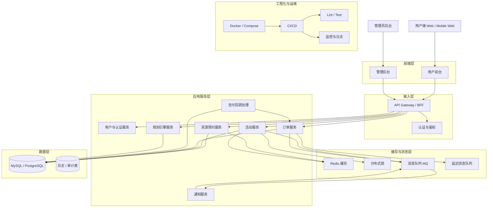

# 系统架构图

## 架构说明
- 前端分为用户前台和管理后台。
- 接入层负责统一 API 入口、认证与鉴权。
- 预约服务负责学术空间与体育设施预约。
- 活动服务负责活动发布、展示、抢票与名额控制。
- 订单服务负责订单创建、状态流转、超时取消。
- 支付回调处理负责支付成功后的异步确认。
- 规则引擎服务负责额度、信用分、身份差异等规则判断。
- Redis 用于缓存预热、热点数据承接。
- 分布式锁用于高并发抢票关键区保护。
- MQ 用于削峰和异步通知。
- 延迟消息用于订单超时取消。
- 关系型数据库承载最终一致性数据。
- Docker + CI/CD 支撑自动化交付。
