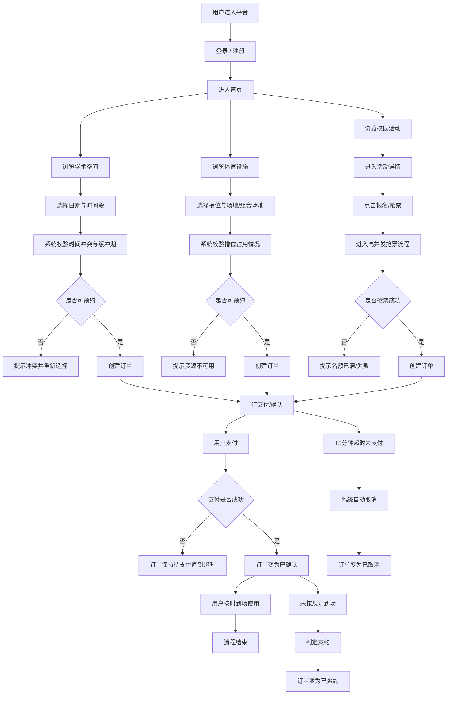

# 用户流程图

```mermaid
flowchart TD

    A[用户进入平台] --> B[登录 / 注册]
    B --> C[进入首页]

    C --> D1[浏览学术空间]
    C --> D2[浏览体育设施]
    C --> D3[浏览校园活动]

    D1 --> E1[选择日期与时间段]
    E1 --> F1[系统校验时间冲突与缓冲期]
    F1 --> G1{是否可预约}
    G1 -- 否 --> H1[提示冲突并重新选择]
    G1 -- 是 --> I1[创建订单]
    I1 --> J[待支付/确认]

    D2 --> E2[选择槽位与场地/组合场地]
    E2 --> F2[系统校验槽位占用情况]
    F2 --> G2{是否可预约}
    G2 -- 否 --> H2[提示资源不可用]
    G2 -- 是 --> I2[创建订单]
    I2 --> J

    D3 --> E3[进入活动详情]
    E3 --> F3[点击报名/抢票]
    F3 --> G3[进入高并发抢票流程]
    G3 --> H3{是否抢票成功}
    H3 -- 否 --> I3[提示名额已满/失败]
    H3 -- 是 --> I4[创建订单]
    I4 --> J

    J --> K[用户支付]
    K --> L{支付是否成功}
    L -- 否 --> M[订单保持待支付直到超时]
    L -- 是 --> N[订单变为已确认]

    N --> O[用户按时到场使用]
    O --> P[流程结束]

    N --> Q[未按规则到场]
    Q --> R[判定爽约]
    R --> S[订单变为已爽约]

    J --> T[15分钟超时未支付]
    T --> U[系统自动取消]
    U --> V[订单变为已取消]
```

## 流程说明
- 用户入口统一，但根据业务进入三条主流程：学术空间、体育设施、校园活动。
- 预约与抢票成功后，都进入统一订单流程。
- 订单在支付成功后进入已确认。
- 超时未支付进入已取消。
- 已确认后若未履约，可进入已爽约。
