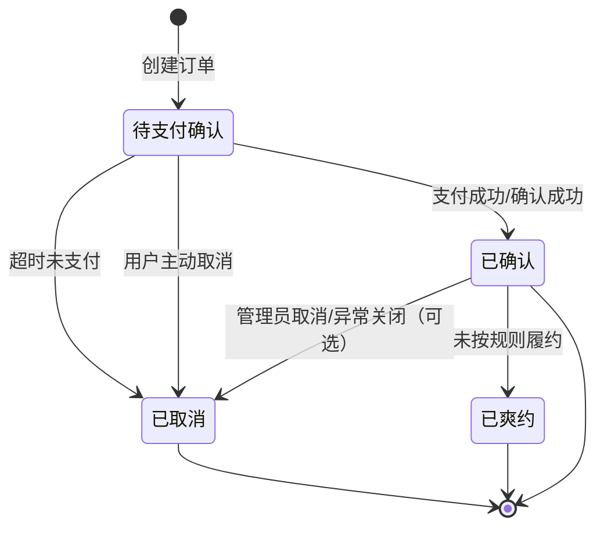

# 订单状态机图

## 状态定义
### 待支付/确认
- 订单刚创建，资源或名额已暂时锁定。
- 等待用户支付或系统确认。

### 已确认
- 支付成功或业务确认完成。
- 用户正式获得预约资格或活动资格。

### 已取消
- 订单失效，不再占用资源。
- 可能由用户主动取消、超时取消或异常处理触发。

### 已爽约
- 用户已确认，但未按要求履约。
- 可联动信用分扣减等规则。

## 关键状态规则
### 1. 待支付到已取消
- 由 15 分钟超时机制触发。
- 应通过延迟消息处理。

### 2. 待支付到已确认
- 由支付成功回调触发。
- 应通过乐观锁或等价机制防并发写冲突。

### 3. 幽灵支付保护
当支付成功和超时取消同时发生时：
- 只能有一个状态更新成功
- 另一个更新必须被拒绝或补偿
- 最终必须保持状态一致

## 实现建议
- 订单表增加 version 字段实现乐观锁
- 支付成功与取消都基于旧状态 CAS 更新
- 延迟队列负责投递超时取消任务
- 所有状态变更必须记录日志
