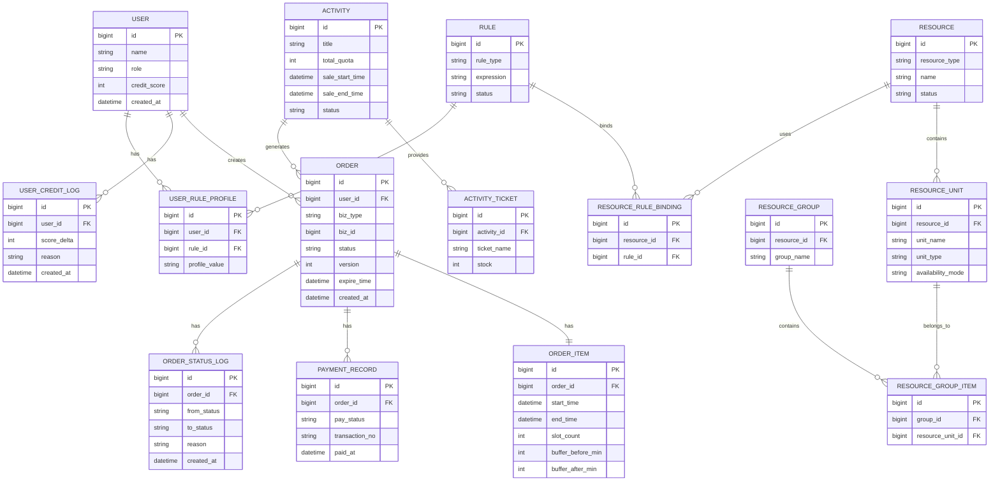

# ER 图 / 数据库关系图

## 设计说明

### 1. 用户
用户是预约与订单发起主体，同时关联信用分与规则画像。

### 2. 资源
资源分为两层：
- RESOURCE：资源主实体
- RESOURCE_UNIT：可被调度的最小单元

这样可兼容：
- 学术空间的单一原子资源
- 体育设施的多个场地单元

### 3. 资源组合
RESOURCE_GROUP 与 RESOURCE_GROUP_ITEM 用于表达体育设施的组合预约能力。

### 4. 活动
ACTIVITY 存储活动主信息。
ACTIVITY_TICKET 存储活动票种或名额信息。

### 5. 订单
ORDER 是统一订单主表，可同时承接：
- 空间预约订单
- 活动抢票订单

其中：
- biz_type 区分业务类型
- biz_id 指向对应业务对象
- status 表示订单状态
- version 用于乐观锁
- expire_time 用于超时取消

### 6. 订单明细
ORDER_ITEM 记录预约时间范围、槽位数量、前后缓冲等信息。

### 7. 支付与状态日志
PAYMENT_RECORD 记录支付流水。
ORDER_STATUS_LOG 记录每次状态迁移，便于审计与排障。

### 8. 规则引擎
RULE 存储规则定义。
RESOURCE_RULE_BINDING 让资源可绑定规则。
USER_RULE_PROFILE 让用户适配个性化限制。

### 9. 信用分
USER_CREDIT_LOG 记录爽约、扣分、恢复等信用变化。
